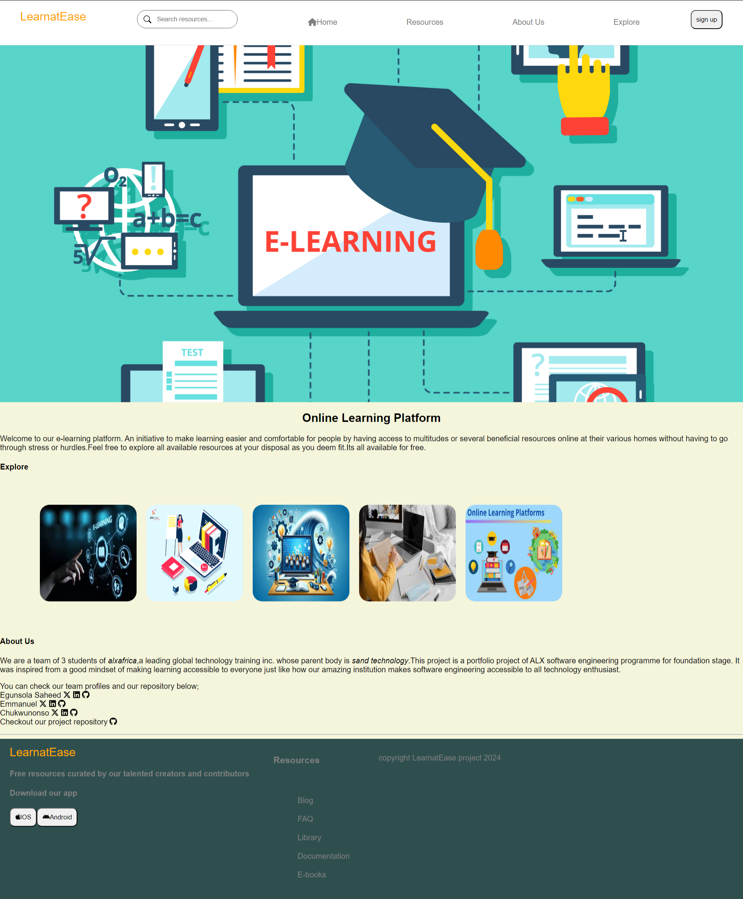

# E-learning Platform

# Introduction

##  Welcome to our E-learning platform. 
An initiative to make learning easier and comfortable for people by having access to multitudes or several beneficial resources online at their various homes without having to go through stress or hurdles.Feel free to explore all available resources at your disposal as you deem fit.Its all available for free

##  Mission: 
Democratize education by providing free, high-quality learning resources to everyone, regardless of their location, background, or financial circumstances. Empower individuals through knowledge and skills development.

#   Technical Challenge
One of the primary technical challenges was designing a user-friendly and visually appealing landing page that effectively communicates the platform’s purpose. Implementing a responsive design that looks great on both desktop and mobile devices was crucial. Additionally, creating a smooth and intuitive user experience required thoughtful consideration of the navigation and key features.

#   Technical Details
Front-End: The landing page was built using HTML, CSS and JAVASCRIPT, focusing on creating a clean and modern design. The CSS includes custom styles for a navigation menu. This approach helps in delivering a consistent user experience across different devices.

[Click here to see the deployed webpage](https://eonemmanuel.github.io/Educa/) 

[Click here to see Authors Linkedln](https://www.linkedin.com/in/eon-emmanuel-864b06264?utm_source=share&utm_campaign=share_via&utm_content=profile&utm_medium=android_app) 

[Click here to see Authors Linkedln](https://www.linkedin.com/in/kuzue-chukwunonso-0b3170165?utm_source=share&utm_campaign=share_via&utm_content=profile&utm_medium=android_app) 

[Click here to see Authors Linkedln](https://www.linkedin.com/in/saheed-egunsola-442a4279?utm_source=share&utm_campaign=share_via&utm_content=profile&utm_medium=android_app)

- [Installation](#installation)
- [Usage](#usage)
- [Credits](#credits)
- [License](#license)

## Installation
To view or contribute to the project, follow these steps:

1.  Clone the Repository:

<pre>https://github.com/EonEmmanuel/Educa.git</pre>

2. Navigate to the Project Directory:

<pre>cd  e-learning-platform</pre>

3.  Open the index.html File:

You can open the index.html file in your browser to view the landing page locally.

## Usage
Simply open the index.html <pre>index.html</pre> file in your web browser to view the landing page. For a live version of the platform,  visit E-Learning Platform <pre>https://eonemmanuel.github.io/Educa/.</pre>

To access and use the deployed page, you only need a web browser like Chrome, Firefox, Safari, or Edge. Navigate to the URL, and the Deployed page will load directly in your browser.

### images:

## Credits

1.  Abu-Baasit
2.  Chukwunonso10
3.  EonEmmanuel

## License

This project is licensed under the MIT License. See the LICENSE.md file for more details.

## Features

Navigation Menu: Links to key sections like "Home," "About Us," "Resources," "Explore," and "Sign Up." 
Prominent "Sign Up" Button: Encourages users to create an account. 
Team Members: Highlights the individuals behind the platform and their social media accounts. 
Search Bar: Allows users to search for specific courses or topics. 
Copyright Information: Displays copyright information and the year..

## Contributing

We welcome contributions from the community to enhance the E-learning Platform. 
Pull requests are welcome, For major changes, please open an issue first
to discuss what you would like to change.  
Here's how you can contribute:

### Forking the Project:
Create a fork of the E-learning platform repository on GitHub.

<pre>git clone https://github.com/EonEmmanuel/Educa.git</pre>

### Making Changes:

1.  Clone your forked repository to your local machine. 
2.  Make your changes to the codebase, following the project's coding style guidelines. 
3.  Write clear and concise commit messages.<pre> git add . git commit -m"commit message"</pre> 

### Submitting Pull Requests:

Push your changes to your forked repository on GitHub. <pre>git push</pre>
Create a pull request from your forked repository to the main branch of the original project. 

### Contribution Guidelines:

A detailed CONTRIBUTING.md file outlining the complete contribution process will be available soon.

##  Related Projects

### Moodle
Description: An open-source learning platform designed to provide educators, administrators, and learners with a single robust, secure, and integrated system to create personalized learning environments.
[Moodle on Github](https://github.com/moodle/moodle) 

### Open edX
Description: A comprehensive open-source platform for online learning. It is used to create and deliver online courses and is known for its scalability and flexibility.
[GitHub Open edX](https://github.com/openedx/edx-platform)
